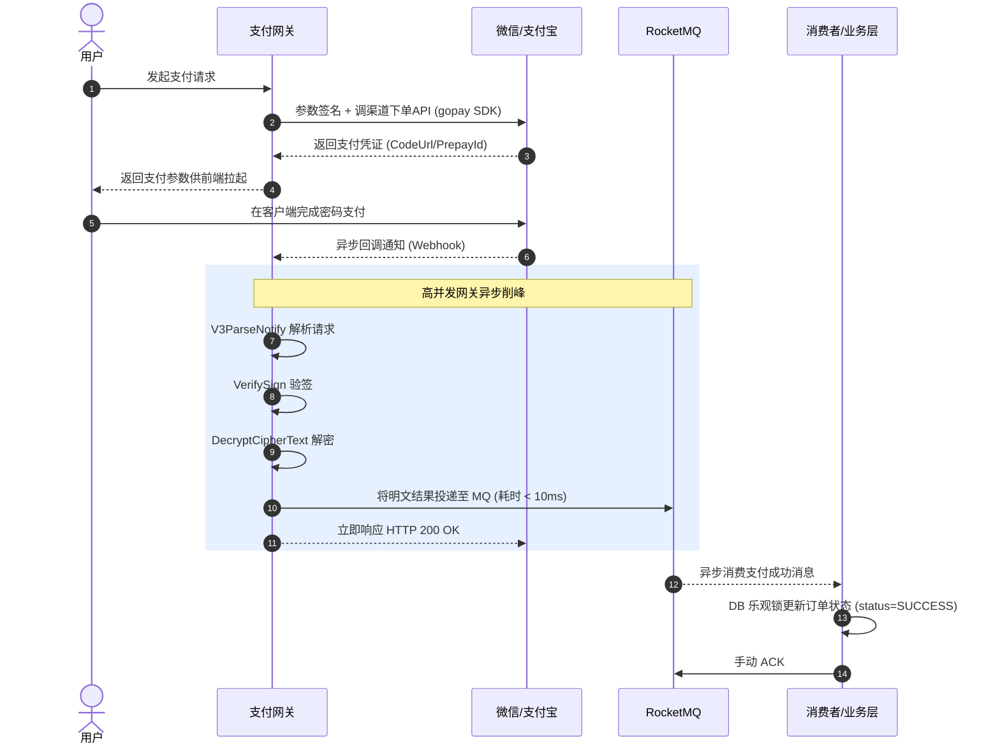

# GoPay: 企业级多渠道支付网关 SDK

<p align="center">
  
</p>

<p align="center">
  
  
  
  
</p>

`gopay` 是一款生产级 Golang 支付 SDK，统一封装微信、支付宝、PayPal、QQ、通联、拉卡拉、扫呗、Apple 等 **8 大支付渠道**，屏蔽底层接口差异，让开发者用一套代码完成多渠道接入。

项目核心价值：**统一参数构造 (BodyMap) + 统一调用模式 (Context + BodyMap) + 统一回调验签**，配合异步消息队列架构可轻松支撑高并发交易场景。

---

## 项目架构与目录结构

```text
gopay/
├── alipay/           # 支付宝 (V2 + V3，推荐 V3)
├── wechat/           # 微信支付 (V2 + V3，推荐 V3)
├── apple/            # Apple IAP 支付校验
├── paypal/           # PayPal 国际支付
├── qq/               # QQ 支付
├── allinpay/         # 通联支付
├── lakala/           # 拉卡拉支付
├── saobei/           # 扫呗支付
├── pkg/              # 公共工具：xhttp 请求封装、JWT 等
├── doc/              # 各渠道 API 文档
├── examples/         # 微信 & 支付宝接入示例
├── body_map.go       # 核心：动态参数构造器 BodyMap
├── constant.go       # 全局常量与版本号
└── release_note.md   # 版本变更记录
```

---

## 核心能力总览

| 渠道 | 下单支付 | 订单查询 | 退款 | 退款查询 | 回调验签 | 证书管理 |
| :--- | :---: | :---: | :---: | :---: | :---: | :---: |
| **微信 V3** | ✅ | ✅ | ✅ | ✅ | ✅ | ✅ 自动验签 |
| **支付宝 V3** | ✅ | ✅ | ✅ | ✅ | ✅ | ✅ |
| **PayPal** | ✅ | ✅ | ✅ | ✅ | ✅ | — |
| **QQ 支付** | ✅ | ✅ | ✅ | ✅ | ✅ | — |
| **通联支付** | ✅ | ✅ | ✅ | ✅ | ✅ | — |
| **拉卡拉** | ✅ | ✅ | ✅ | ✅ | ✅ | — |
| **扫呗** | ✅ | ✅ | ✅ | ✅ | ✅ | — |
| **Apple** | — | ✅ 校验 | — | — | — | — |

---

## 一笔支付的完整生命周期

使用 Mermaid 呈现的生产级支付流转图：



---

## 快速接入

### 1. 安装
```bash
go get github.com/go-pay/gopay
```

### 2. 核心概念：BodyMap 参数构造

所有支付接口统一使用 `gopay.BodyMap`（底层为 `map[string]any`）来构造请求参数，告别为每个接口定义 struct 的繁琐，灵活应对渠道参数的频繁变动：

```go
bm := make(gopay.BodyMap)
bm.Set("out_trade_no", "GoPay202604210001").
    Set("description", "用户钱包充值").
    Set("notify_url", "https://your-domain.com/wechat/notify")

// 支持闭包嵌套结构构建复杂的 JSON Body
bm.SetBodyMap("amount", func(b gopay.BodyMap) {
    b.Set("total", 100).       // 微信单位：分
      Set("currency", "CNY")
})

// 内置参数校验：检查必填字段是否为空
err := bm.CheckEmptyError("out_trade_no", "description")
```

### 3. 统一调用模式

所有渠道的 API 调用遵循相同范式，极大降低心智负担：
`client.Method(ctx, bm) → (typedResponse, error)`

---

## 微信支付 V3 实战

### 客户端初始化
```go
import "github.com/go-pay/gopay/wechat/v3"

// 参数：商户ID、证书序列号、APIv3Key、私钥内容(apiclient_key.pem)
client, err := wechat.NewClientV3("MchId", "SerialNo", "APIv3Key", "PrivateKeyContent")
if err != nil {
    panic(err)
}

// 推荐：开启自动验签。会自动启动一个后台 goroutine 每 12 小时拉取一次微信最新平台证书
err = client.AutoVerifySign()

// 设置超时控制客户端
client.SetHttpClient(xhttp.NewClient())

// 可选：开启 Debug 日志，排障利器
client.DebugSwitch = gopay.DebugOn
```

### Native 下单（充值场景 - 扫码支付）
```go
bm := make(gopay.BodyMap)
bm.Set("appid", "wx12345678").
    Set("description", "钱包充值100元").
    Set("out_trade_no", "RECHARGE_202604210001").
    Set("notify_url", "https://your-domain.com/wechat/notify").
    SetBodyMap("amount", func(b gopay.BodyMap) {
        b.Set("total", 10000).    // 100元 = 10000分
          Set("currency", "CNY")
    })

// 传入 context，支持超时控制和链路追踪
ctx, cancel := context.WithTimeout(context.Background(), 5*time.Second)
defer cancel()

wxRsp, err := client.V3TransactionNative(ctx, bm)
if err != nil {
    xlog.Errorf("请求异常: %v", err)
    return
}
// wxRsp.Response.CodeUrl 即为支付二维码链接
xlog.Infof("Native 下单成功, code_url: %s", wxRsp.Response.CodeUrl)
```

### 支付回调处理
```go
import "net/http"

func WechatNotifyHandler(req *http.Request) {
    // 1. 解析回调请求 (自动读取 Body 并解析 Header 中的签名信息)
    notifyReq, err := wechat.V3ParseNotify(req)
    if err != nil {
        xlog.Errorf("回调解析失败: %v", err)
        return
    }

    // 2. 使用底层维护的证书公钥进行验签
    err = notifyReq.VerifySignByPKMap(client.SnCertMap.Map())
    if err != nil {
        xlog.Errorf("验签失败: %v", err)
        return
    }

    // 3. 解密支付结果（支付回调用 DecryptPayCipherText）
    result, err := notifyReq.DecryptPayCipherText("APIv3Key")
    if err != nil {
        xlog.Errorf("解密失败: %v", err)
        return
    }

    // 4. result 包含完整明文支付信息
    xlog.Infof("支付成功: 订单号=%s, 微信交易号=%s, 金额=%d分",
        result.OutTradeNo, result.TransactionId, result.Amount.Total)

    // ===== 生产环境最佳实践 =====
    // 不要在回调中直接执行耗时的数据库操作！
    // 推荐：将 result 投递到 RocketMQ/Kafka，由消费者异步处理
    // 这样可以极速响应微信 200 OK，避免超时重试
}
```

---

## 支付宝 V3 实战

### 客户端初始化
```go
import "github.com/go-pay/gopay/alipay/v3"

// 参数：应用ID、应用私钥、是否正式环境
client, err := alipay.NewClientV3("AppId", "PrivateKey", true)
if err != nil {
    panic(err)
}

// 设置证书（生产环境强烈推荐证书模式）
err = client.SetCert(
    appCertContent,          // 应用公钥证书内容
    alipayRootCertContent,   // 支付宝根证书内容
    alipayPublicCertContent, // 支付宝公钥证书内容
)

client.DebugSwitch = gopay.DebugOn
```

### 统一收单 - 网页支付 (PagePay)
```go
bm := make(gopay.BodyMap)
bm.Set("subject", "钱包充值100元").
    Set("out_trade_no", "ALI_RECHARGE_202604210001").
    Set("total_amount", "100.00").   // 注意：支付宝单位是元，必须是 string 类型
    Set("product_code", "FAST_INSTANT_TRADE_PAY").
    Set("return_url", "https://your-domain.com/pay/success")

// PagePay 返回的是可以直接在浏览器中重定向的 URL
payUrl, err := client.TradePagePay(ctx, bm)
```

### 退款
```go
bm := make(gopay.BodyMap)
bm.Set("out_trade_no", "ALI_RECHARGE_202604210001").
    Set("refund_amount", "50.00").            // 退款金额（元）
    Set("out_request_no", "ALI_REFUND_001")   // 同一笔订单多次部分退款时必须不同

aliRsp, err := client.TradeRefund(ctx, bm)
```

### 订单查询
```go
bm := make(gopay.BodyMap)
bm.Set("out_trade_no", "ALI_RECHARGE_202604210001")
aliRsp, err := client.TradeQuery(ctx, bm)
// aliRsp.TradeStatus: WAIT_BUYER_PAY / TRADE_SUCCESS / TRADE_CLOSED
```

---

## 微信支付更多场景

### JSAPI 下单（小程序/公众号）
```go
bm := make(gopay.BodyMap)
bm.Set("appid", "wx12345678").
    Set("description", "订单支付").
    Set("out_trade_no", "ORDER_202604210001").
    Set("notify_url", "https://your-domain.com/wechat/notify").
    SetBodyMap("amount", func(b gopay.BodyMap) {
        b.Set("total", 100)
    }).
    SetBodyMap("payer", func(b gopay.BodyMap) {
        b.Set("openid", "user_openid_xxx")  // JSAPI 必须传 openid
    })

wxRsp, err := client.V3TransactionJsapi(ctx, bm)
// wxRsp.Response.PrepayId 用于前端调起支付
```

### 退款申请
```go
bm := make(gopay.BodyMap)
bm.Set("out_trade_no", "RECHARGE_202604210001").
    Set("out_refund_no", "REFUND_202604210001").
    Set("notify_url", "https://your-domain.com/wechat/refund-notify").
    SetBodyMap("amount", func(b gopay.BodyMap) {
        b.Set("refund", 5000).    // 退款金额（分）
          Set("total", 10000).    // 原订单金额（分）
          Set("currency", "CNY")
    })

refundRsp, err := client.V3Refund(ctx, bm)
xlog.Infof("微信退款号: %s", refundRsp.Response.RefundId)
```

### 订单查询 & 关单
```go
// 按商户订单号查询
wxRsp, err := client.V3TransactionQueryOrder(ctx, wechat.OutTradeNo, "ORDER_202604210001")
// wxRsp.Response.TradeState: SUCCESS / NOTPAY / CLOSED / REFUND

// 关闭超时未支付订单
wxRsp, err := client.V3TransactionCloseOrder(ctx, "ORDER_202604210001")
```

### 下载对账单（T+1 对账用）
```go
// 1. 获取账单下载链接
bm := make(gopay.BodyMap)
bm.Set("bill_date", "2026-04-23").
    Set("bill_type", "ALL")  // ALL=全部 SUCCESS=成功 REFUND=退款

billRsp, err := client.V3BillTradeBill(ctx, bm)

// 2. 下载账单文件
fileBytes, err := client.V3BillDownLoadBill(ctx, billRsp.Response.DownloadUrl)
os.WriteFile("bill_20260423.csv", fileBytes, 0644)
```

---

## 核心数据库表设计（生产参考）

> [!IMPORTANT]
> 以下表结构设计经过了千万级流水的实战检验。

### 支付订单表 t_pay_order

```sql
CREATE TABLE t_pay_order (
    id              BIGINT UNSIGNED AUTO_INCREMENT PRIMARY KEY,
    out_trade_no    VARCHAR(64)  NOT NULL COMMENT '商户订单号（全局唯一）',
    channel         VARCHAR(16)  NOT NULL COMMENT '支付渠道: WECHAT/ALIPAY/PAYPAL',
    trade_type      VARCHAR(16)  NOT NULL COMMENT '交易类型: NATIVE/JSAPI/APP/H5',
    transaction_id  VARCHAR(64)  DEFAULT '' COMMENT '渠道交易号（微信/支付宝返回）',
    amount          INT UNSIGNED NOT NULL COMMENT '订单金额（统一用分）',
    status          VARCHAR(16)  NOT NULL DEFAULT 'INIT' COMMENT 'INIT/PAYING/SUCCESS/FAILED/CLOSED',
    notify_url      VARCHAR(256) NOT NULL COMMENT '回调通知地址',
    user_id         BIGINT UNSIGNED NOT NULL COMMENT '用户ID',
    description     VARCHAR(128) DEFAULT '' COMMENT '商品描述',
    pay_time        DATETIME     DEFAULT NULL COMMENT '支付成功时间',
    expire_time     DATETIME     NOT NULL COMMENT '订单过期时间',
    created_at      DATETIME     NOT NULL DEFAULT CURRENT_TIMESTAMP,
    updated_at      DATETIME     NOT NULL DEFAULT CURRENT_TIMESTAMP ON UPDATE CURRENT_TIMESTAMP,
    UNIQUE KEY uk_out_trade_no (out_trade_no),
    INDEX idx_user_id (user_id),
    INDEX idx_status_created (status, created_at)
) ENGINE=InnoDB DEFAULT CHARSET=utf8mb4 COMMENT='支付订单表';
```

### 退款单表 t_refund_order

```sql
CREATE TABLE t_refund_order (
    id              BIGINT UNSIGNED AUTO_INCREMENT PRIMARY KEY,
    out_refund_no   VARCHAR(64)  NOT NULL COMMENT '商户退款单号',
    out_trade_no    VARCHAR(64)  NOT NULL COMMENT '原支付订单号',
    refund_id       VARCHAR(64)  DEFAULT '' COMMENT '渠道退款号',
    channel         VARCHAR(16)  NOT NULL COMMENT '支付渠道',
    refund_amount   INT UNSIGNED NOT NULL COMMENT '退款金额（分）',
    total_amount    INT UNSIGNED NOT NULL COMMENT '原订单金额（分）',
    status          VARCHAR(16)  NOT NULL DEFAULT 'REFUNDING' COMMENT 'REFUNDING/REFUND_SUCCESS/REFUND_FAILED',
    reason          VARCHAR(256) DEFAULT '' COMMENT '退款原因',
    created_at      DATETIME     NOT NULL DEFAULT CURRENT_TIMESTAMP,
    updated_at      DATETIME     NOT NULL DEFAULT CURRENT_TIMESTAMP ON UPDATE CURRENT_TIMESTAMP,
    UNIQUE KEY uk_out_refund_no (out_refund_no),
    INDEX idx_out_trade_no (out_trade_no)
) ENGINE=InnoDB DEFAULT CHARSET=utf8mb4 COMMENT='退款单表';
```

### 本地消息兜底表 t_message_fallback

```sql
CREATE TABLE t_message_fallback (
    id          BIGINT UNSIGNED AUTO_INCREMENT PRIMARY KEY,
    topic       VARCHAR(64)  NOT NULL COMMENT 'MQ topic',
    msg_key     VARCHAR(64)  NOT NULL COMMENT '消息唯一键（订单号）',
    msg_body    TEXT         NOT NULL COMMENT '消息体 JSON',
    status      TINYINT      NOT NULL DEFAULT 0 COMMENT '0=待发送 1=已发送 2=发送失败',
    retry_count INT          NOT NULL DEFAULT 0 COMMENT '重试次数',
    next_retry  DATETIME     NOT NULL COMMENT '下次重试时间',
    created_at  DATETIME     NOT NULL DEFAULT CURRENT_TIMESTAMP,
    INDEX idx_status_retry (status, next_retry)
) ENGINE=InnoDB DEFAULT CHARSET=utf8mb4 COMMENT='本地消息兜底表';
```

### 关键设计说明

| 设计点 | 业务考量说明 |
| :--- | :--- |
| **金额统一用分 (int)** | 消除微信(分)和支付宝(元)的单位差异，规避 `0.1 + 0.2 != 0.3` 的浮点精度问题。 |
| **out_trade_no 唯一索引** | 数据库层面的兜底防线，保证订单号全局唯一，绝对防止重复下单。 |
| **status 字段做乐观锁** | 核心！更新状态时必须带 `UPDATE ... WHERE status='PAYING'`，实现并发回调的幂等处理。 |
| **退款独立分表** | 一笔支付可多次部分退款，退款逻辑独立于支付。通过 `out_trade_no` 与支付单关联。 |
| **idx_status_created 索引**| 定时任务扫描超时 `PAYING` 订单专用索引，避免全表扫描。 |
| **本地消息表 idx_status_retry** | 定时补偿任务仅扫描 `status=0 AND next_retry < NOW()` 的记录，指数退避重发。 |

---

## 异步架构最佳实践（RocketMQ 削峰）

> [!TIP]
> 同步处理回调会导致高峰期数据库连接池被耗尽。引入 MQ 是解决高并发支付回调的标准方案。

### 可靠性三道防线

| 防线 | 机制 | 解决的问题 |
| :--- | :--- | :--- |
| **发端可靠投递** | 本地消息表 + 定时扫描补偿重发 | 防止网关验签后往 MQ 投递消息时遭遇网络抖动或 Broker 宕机导致消息丢失。 |
| **收端幂等消费** | 手动 ACK + 数据库状态机乐观锁 | 防止 MQ 重复投递导致一笔订单被多次结算。`affected_rows = 0` 时天然丢弃处理。 |
| **终极异步兜底** | DLQ 死信队列 + 主动查单 + T+1 对账 | 消费者彻底挂掉或出现极端网络分区的最终兜底，通过对账产生短款自动触发补单。 |

**实战效果**：此架构可将消息丢失率压低至 **< 0.01%**（以日终对账差异率度量）。

---

## 生产环境注意事项

### 1. 金额单位差异（极易踩坑）

| 渠道 | 金额单位 | 参数类型 | 示例 | 建议存储方式 |
| :--- | :--- | :--- | :--- | :--- |
| **微信支付** | **分** | int | 100 = 1元 | INT 存 100 |
| **支付宝** | **元** | string | "1.00" = 1元 | 转为分(INT)存 100 |

### 2. 回调幂等控制
支付渠道由于网络原因极容易发生重复回调通知，**务必保证回调处理逻辑的幂等性**：
- 数据库更新带状态前置条件（`WHERE status = 'PAYING'`），这是最核心、最可靠的防线。
- 如果并发量极大，建议在 Redis 中使用 `SETNX(out_trade_no, 1, 10s)` 做前置去重拦截，保护数据库。

### 3. 避免并发退款
同一笔订单如果在短时间内发生极高并发的多次部分退款请求，极易触发微信/支付宝的风控拦截。建议使用分布式锁进行串行控制：
```go
lockKey := fmt.Sprintf("refund:lock:%s", outTradeNo)
// 获取 Redis 分布式互斥锁
```

### 4. 证书安全与轮换
- **禁止硬编码**：私钥 (`.pem`) 和 APIv3Key 必须从配置中心 (Nacos/Apollo) 或密钥管理服务 (Vault) 加密挂载，坚决不能入 Git 代码库。
- **证书更新**：微信平台公钥证书有有效期，务必开启 `client.AutoVerifySign()`，SDK 会自动在后台续期。

---

## 监控与告警

生产级支付网关必须建立如下黄金监控指标：

| 监控大盘指标 | 告警阈值建议 | 排障思路 |
| :--- | :--- | :--- |
| **支付成功率** | < 95% 告警 | (成功订单数 / 总下单数)。如果是断崖式下跌，立刻检查渠道证书是否过期、网络是否被阻断。 |
| **回调网关延迟** | > 100ms 告警 | 重点关注网关层验签和投递 MQ 的耗时。 |
| **MQ 消费积压** | > 1000 条告警 | Consumer Offset 落后太多，说明消费者处理慢或卡死，可能是下游 DB 连接被打满。 |
| **对账差异数** | > 0 告警 | T+1 对账后的长/短款数量。短款需排查消息流转，长款需排查风控告警。 |
| **死信队列堆积** | > 0 告警 | 只要进入 DLQ，说明消费者经历了 16 次重试依然失败，必须人工介入看日志抛出的异常。 |

---

## BodyMap 常用 API 速查

| 方法 | 说明 | 示例 |
| :--- | :--- | :--- |
| `Set(key, value)` | 设置参数，支持链式调用 | `bm.Set("appid", "wx123").Set("total", 100)` |
| `SetBodyMap(key, fn)` | 构建嵌套 JSON 结构 | `bm.SetBodyMap("amount", func(b) { b.Set("total", 100) })` |
| `Get(key)` / `GetString(key)` | 获取参数值（string） | `bm.Get("appid")` |
| `GetAny(key)` | 获取原始值（any 类型） | `bm.GetAny("total")` |
| `Remove(key)` | 删除参数 | `bm.Remove("attach")` |
| `CheckEmptyError(keys...)` | 校验必填字段 | `bm.CheckEmptyError("out_trade_no", "amount")` |
| `JsonBody()` | 序列化为 JSON 字符串 | 用于日志输出或调试 |
| `Unmarshal(ptr)` | 反序列化到结构体 | `bm.Unmarshal(&order)` |
| `Reset()` | 清空所有参数（复用） | 高并发场景配合 sync.Pool |

---

## 调试与日志

```go
// 开启 Debug 模式，打印完整的请求/响应日志
client.DebugSwitch = gopay.DebugOn

// 自定义 Logger（实现 xlog.XLogger 接口）
client.SetLogger(yourCustomLogger)

// 设置代理（内网无法直连微信时使用）
client.SetProxyHost("https://proxy.internal.com")
```

---

## 更多资源

- 完整接入代码示例：[readme_example.md](./readme_example.md)
- 面试与架构演进深度解析：[readme_mianshi.md](./readme_mianshi.md)
- 版本变更记录：[release_note.md](./release_note.md)
