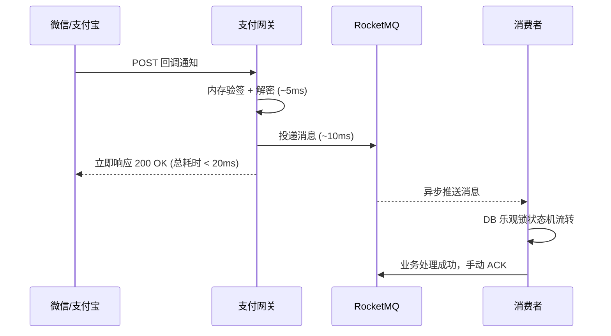

# 支付系统核心技术与面试通关指南

> [!TIP]
> 本文档基于真实简历项目（**RocketMQ 消息总线重构、退款/充值链路实现、核心模块扩展性重构、QPS 提升 10%、消息丢失率 <0.01%**）提炼。为您提供一套高逻辑密度、数据支撑的面试答题框架，专治各种高频追问和深度连环炮。

---

## 一、 项目叙事（STAR 法则）

### 🌟 标准版话术（建议时长：1.5 分钟）

> "在公司核心支付系统的重构中，我主导解决了系统原有的两大痛点：第一，**支付渠道与业务逻辑强耦合**，每接入一个新渠道（如从微信扩展到支付宝）都需要大量修改旧代码，极易引发回归 Bug；第二，**回调处理采用传统的同步大事务模式**，流量高峰时数据库连接池被严重占用，导致微信回调超时并引发重试雪崩，客诉频发。
>
> 针对这些问题，我实施了三个方向的重构：
> 1. **架构解耦**：引入 RocketMQ 实现回调异步削峰。网关层现在变为了无状态节点，只负责验签解密后立即将消息投递至 MQ，并在 20ms 内快速响应渠道 200 OK。
> 2. **代码重构**：基于**策略模式加简单工厂**重构了支付渠道接入层，实现了新渠道的热插拔，符合开闭原则（OCP）。
> 3. **链路完善**：完整实现了状态机驱动的充值和退款业务链路，并落地了本地消息表、幂等控制和 T+1 对账体系。
>
> **最终收益**：核心回调接口的长事务转变为短事务，数据库连接复用率大幅提升，**系统 QPS 提升了 10%**；更重要的是，通过三道可靠性防线，**消息丢失率从之前的偶发丢单降至了 <0.01%**。"

### 💡 简历埋点解析（面试官的"诱饵"）

上述话术中故意埋下了技术深度的伏笔，引导面试官提问：
- **"异步削峰"** → 引导追问 MQ 选型及消息的可靠性保障。
- **"QPS 提升 10%"** → 引导追问：为什么引入中间件增加了一次网络 I/O，QPS 反而提升了？
- **"丢失率 <0.01%"** → 引导追问度量手段（对账）和兜底机制。
- **"策略模式"** → 引导代码设计能力考察。
- **"状态机"** → 引导分布式一致性和资金安全考察。

---

## 二、 架构演进：从同步大事务到异步削峰（核心考点）

### 旧架构的痛点（同步大事务）

```text
微信/支付宝 → POST Webhook
    → 网关开启数据库事务
    → 查单 + 悲观锁 (SELECT ... FOR UPDATE)
    → 调用复杂的充值/退款服务核心逻辑
    → 提交事务 (耗时 200ms+)
    → 响应 200 OK
```

**致命问题**：
1. **连接耗尽**：事务持有时间过长（200ms+），高并发下数据库连接瞬间被打满。
2. **雪崩效应**：微信回调要求严格（超时阈值 5s）。一旦系统变慢，微信判定失败并触发重试（15s, 15s, 30s...），成倍放大的流量最终压垮系统。
3. **死锁风险**：悲观锁并发竞争严重，极端情况下产生死锁。

### 新架构的破局（异步削峰）



### 🎯 深度追问

**Q：为什么引入 MQ 增加了一跳网络开销，QPS 反而提升了？**
> **答**：直觉上单次请求的延迟（Latency）可能略微增加，但支付系统的瓶颈在于**并发吞吐量（Throughput）**。
> 旧架构中，每个请求霸占 DB 连接 200ms，如果连接池有 100 个连接，理论极限是 `100 / 0.2s = 500 QPS`。
> 重构后，网关变成极轻量的"消息搬运工"，耗时降至 20ms，同样的连接池支撑的极限变为 `100 / 0.02s = 5000 QPS`。
> QPS 提升 10% 的宏观红利正是来源于**长事务变短事务导致的连接资源被极速复用**。MQ 成功发挥了蓄水池的作用。

---

## 三、 消息可靠性：将丢失率压至 <0.01% 的三道防线

这是支付系统的重中之重。系统不允许丢消息，如果丢了，必须有机制发现并找回。

### 第一道防线：发端可靠投递（本地消息表）

**问题**：网关完成验签后，准备发往 MQ 时，如果网络抖动或 MQ 宕机怎么办？
**方案**：**本地消息表 + 定时补偿重试**。

```text
1. 接收回调 → 验签解密
2. 开启本地事务 → 将消息 JSON 写入 t_message_fallback 表（状态=待发送）
3. 尝试投递 RocketMQ
4. 投递成功 → 更新 fallback 表状态为"已发送"
5. 投递失败 → 不阻塞，直接返回 200 给微信
6. 定时任务（如每 5 秒）扫描"待发送"状态记录执行退避重发
```

**追问：为什么不用 RocketMQ 自带的事务消息？**
> **答**：事务消息解决的是"本地数据库操作"和"MQ消息发送"的原子性问题。在网关层，我们没有复杂的业务 DB 逻辑，唯一的诉求是"只要收到 webhook，就必须保证存下来并投递出去"。本地消息表实现更轻量可控，避免了事务消息"半消息回查"带来的复杂性。

### 第二道防线：收端绝对幂等（乐观锁状态机）

**方案**：**数据库乐观锁 + 手动 ACK**。

```sql
-- 消费者执行更新，带有前置状态条件 (状态机流转)
UPDATE t_pay_order 
SET status = 'SUCCESS', transaction_id = ?, updated_at = NOW()
WHERE out_trade_no = ? AND status = 'PAYING';
```

- **正常处理**：`affected_rows == 1`，更新成功，提交 ACK。
- **重复投递**：由于状态已经被改为 SUCCESS，前置条件 `status = 'PAYING'` 不成立，`affected_rows == 0`。天然实现**绝对幂等**，直接丢弃并提交 ACK。无需引入复杂的 Redis 分布式锁去重。

### 第三道防线：终极兜底（主动查单 + T+1 对账）

- **主动查单**：定时任务每分钟扫描创建时间超过 5 分钟且状态仍为 `PAYING` 的"僵尸订单"，主动调用微信查单 API。以此应对极端网络分区导致的回调彻底丢失。
- **T+1 日终对账**：每天凌晨下载渠道官方账单，与本地数据库全量比对。
  - **短款**（渠道有，我方无）：消息彻底丢失或消费一直报错，自动触发补单。
  - **长款**（我方有，渠道无）：疑似伪造回调或测试数据，抛出风控告警。

### 追问：0.01% 的丢失率是怎么统计的？

> **答**：通过 **T+1 日终对账**量化：
> 1. 每天凌晨下载微信/支付宝前一天的交易账单文件
> 2. 与本地 SUCCESS 状态的订单做全量差异比对
> 3. 丢失率 = 短款笔数 / 渠道总交易笔数
> 4. 上线后连续监控一个月，日均交易 X 万笔，偶发 1-2 笔短款（来自极端网络分区），主动查单任务在 5 分钟内完成补偿

---

## 四、 核心模块重构：策略模式消灭 if-else 腐肉

### 恶心的旧代码
```go
func Pay(channel string, order *Order) {
    if channel == "WECHAT" {
        // 50 行微信逻辑...
    } else if channel == "ALIPAY" {
        // 50 行支付宝逻辑...
    } else if channel == "PAYPAL" {
        // ...
    }
}
// 退款、查询接口里还要把这坨 if-else 再复制一遍。
// 严重违背了 OCP (开闭原则)。
```

### 优雅的策略模式重构

1. **定义顶层接口**：
```go
type PaymentStrategy interface {
    CreateOrder(ctx context.Context, order *Order) (string, error)
    Refund(ctx context.Context, refund *RefundReq) (*RefundResult, error)
    // ...
}
```

2. **具体策略实现（内部利用 GoPay SDK）**：
```go
type WechatStrategy struct { client *wechat.ClientV3 }
func (w *WechatStrategy) CreateOrder(...) { /* 封装 GoPay 微信下单 */ }

type AlipayStrategy struct { client *alipay.ClientV3 }
func (a *AlipayStrategy) CreateOrder(...) { /* 封装 GoPay 支付宝下单 */ }
```

3. **简单工厂路由分发**：
```go
func HandlePay(ctx context.Context, channel string, order *Order) error {
    strategy := GetPaymentStrategy(channel) // 工厂方法获取实例
    if strategy == nil { return fmt.Errorf("unsupported channel") }
    
    return strategy.CreateOrder(ctx, order) // 接口多态调用
}
```

> [!NOTE] 
> **Go 语言特性追问**：Go 的 interface 是**隐式实现（鸭子类型）**。结构体不需要像 Java 一样显式声明 `implements`。为了防止重构时漏写接口方法，通常会在代码中加一行编译期静态检查断言：`var _ PaymentStrategy = (*WechatStrategy)(nil)`。

---

## 五、 Go 语言核心特性追问 (结合业务落地)

### Q：context.Context 在你的支付系统里是怎么使用的？

> **答**：Context 是 Go 并发控制的灵魂。在我的项目中主要有两处核心应用：
> 1. **超时控制 (Timeout)**：调用微信/支付宝等所有外部网络请求时，必须包裹 `context.WithTimeout(ctx, 5*time.Second)`。防止外部 API 卡死导致我方的 goroutine 大量挂起，最终吃光内存引发 OOM。
> 2. **链路追踪 (TraceId)**：利用 `context.WithValue` 在网关层注入生成的 TraceId。无论是记录 xlog 日志，还是进行 DB 查询，甚至将日志发往 ELK，都会提取这个 TraceId。这对金融系统的排障至关重要。

### Q：有排查过 goroutine 泄漏问题吗？

> **答**：支付核心链路最怕 goroutine 泄露。
> **监控手段**：通过 Prometheus 持续采集 `runtime.NumGoroutine()`。
> **排查经验**：如果指标呈明显的只增不减趋势，我会通过 `pprof` 导出 goroutine profile。常见的泄露原因无外乎三种：
> 1. Channel 读写阻塞（如往一个没有消费者的无缓冲 channel 写数据）。
> 2. HTTP 发起调用未设置 Timeout。
> 3. 忘记执行 `defer cancel()`。

### Q：你们的支付服务是怎么做优雅停机 (Graceful Shutdown) 的？

> **答**：支付服务绝对不能 `kill -9` 暴力重启，会导致正在执行的交易中断。
> 标准套路是监听系统信号：
> ```go
> quit := make(chan os.Signal, 1)
> signal.Notify(quit, syscall.SIGINT, syscall.SIGTERM)
> <-quit // 阻塞等待退出信号
> 
> // 1. 切断入口：HTTP Server 执行 Shutdown()，拒绝新请求但等待老请求执行完毕。
> // 2. 停消费：停止 RocketMQ 消费者的拉取，并等待当前正在处理的 Message 消费完毕。
> // 3. 释放资源：关闭 MySQL 连接池，关闭 Redis 客户端。
> ```

---

## 六、 进阶与难点剖析

### Q：RocketMQ 是怎么保证消息顺序的？支付成功和退款消息乱序怎么办？

> **答**：常规做法是基于 `out_trade_no` 将同一订单的消息路由到同一个 MessageQueue。但其实在我们的架构中，**乱序并不可怕，因为状态机做了保底**。
> 假设退款回调先到了，支付成功回调后到。退款消费者会执行 `UPDATE WHERE status = 'SUCCESS'`，但此时状态是 `PAYING`，影响行数为 0，退款消息消费失败，会被打回重试队列。等支付回调处理完（状态变为 SUCCESS）后，退款消息重试时就能正确流转了。**利用数据库状态机抗乱序是极其优雅的方案。**

### Q：你们系统是怎么防重放攻击的？

> **答**：
> 1. **渠道签名防伪**：微信 V3 的 HTTP Header 中自带 RSA 签名，且包含了 Timestamp 和 Nonce。我们会校验时间戳是否过期（通常宽限期 5 分钟），拦截大批量的重放。
> 2. **最底层的绝对防线**：即使黑客在 5 分钟内疯狂重放，最终落地到 DB 时，`WHERE status = 'PAYING'` 的乐观锁状态机只允许第一笔请求执行成功，后续的重复请求全都会因为 `affected_rows = 0` 被无害化处理。

### Q：如果让你重新做一次这个项目，你会做哪些改变？

> **答**：
> 1. **对账前置**：早期我更看重代码架构，对账系统是后期亡羊补牢加上的。实际上，对于金融支付系统，"对账单才是唯一的真相"。重来一次的话，我会把对账作为核心模块在第一天就设计进去。
> 2. **更加结构化的日志**：前期使用了纯文本日志，排查跨微服务问题时肉眼搜索极度痛苦。应该尽早接入具有 JSON 格式和 TraceId 串联的结构化日志体系。

---

## 七、 状态机设计：资金安全的核心保障

### 充值状态流转
```text
         创建订单          调起支付            回调/查单
  INIT ──────────> PAYING ──────────> SUCCESS
                     │                    
                     │ 支付失败/超时关单      
                     ├──────────> FAILED   
                     └──────────> CLOSED   
```

### 退款状态流转
```text
         发起退款              回调/查询
  (原订单 SUCCESS) ──> REFUNDING ──────────> REFUND_SUCCESS
                          │
                          └──────────> REFUND_FAILED
```

### 核心原则
1. **所有状态变更必须带前置条件**：`UPDATE ... WHERE status = '旧状态'`
2. **禁止跳跃式变更**：不允许从 INIT 直接到 SUCCESS
3. **终态不可变**：SUCCESS/FAILED/CLOSED 一旦写入不允许再修改
4. **退款独立建表**：一笔支付可能多次部分退款

---

## 八、 数据库设计追问

### Q：索引怎么设计的？
> - `out_trade_no` 唯一索引：保证订单号全局唯一 + 加速回调查单
> - `(status, created_at)` 联合索引：定时任务扫描超时 PAYING 订单，避免全表扫描
> - `user_id` 索引：用户查询"我的订单"
> - `t_message_fallback` 上 `(status, next_retry)` 联合索引：定时补偿任务扫描用

### Q：订单量大了怎么办？
> 1. **短期**：按时间 RANGE 分区，历史数据归档到冷库
> 2. **中期**：读写分离，查询走从库
> 3. **长期**：按 user_id 分片（ShardingSphere/TiDB），同一用户订单在同一分片
> 4. **分片后挑战**：out_trade_no 跨分片查询——在订单号中编码分片键（如 `{userId后4位}_{时间戳}_{随机数}`）

### Q：为什么金额用 int 而不是 decimal？
> 1. int 运算不存在 `0.1 + 0.2 != 0.3` 的浮点精度坑
> 2. int 比较和计算性能更好
> 3. 统一用"分"作为最小单位，入参时转换，出参时按渠道格式化

---

## 九、 MQ 选型与安全追问

### Q：为什么选 RocketMQ 而不是 Kafka/RabbitMQ？
> - **vs Kafka**：Kafka 偏大数据流处理，batch 攒批发送延迟高。RocketMQ 原生支持事务消息、延迟消息、死信队列，对支付更友好。
> - **vs RabbitMQ**：单机吞吐万级，Erlang 运维成本高。RocketMQ 十万级 TPS，经过阿里双 11 验证。
> - **核心考量**：**金融级可靠性 > 极致吞吐量**。同步刷盘 + 主从同步复制保证 broker 宕机不丢消息。

### Q：支付回调怎么防止伪造？
> 1. **签名验证**：微信 V3 用 RSA 非对称签名，gopay 的 `V3ParseNotify()` 内部已封装
> 2. **HTTPS**：回调地址必须 HTTPS
> 3. **幂等兜底**：即使签名被绕过，乐观锁 `WHERE status='PAYING'` 保证不会重复处理

### Q：敏感信息怎么管理？
> 1. 禁止硬编码到代码，禁止提交 Git
> 2. 从配置中心（Nacos/Apollo）或密钥管理服务（Vault）动态加载
> 3. 容器内不落盘，通过环境变量注入

---

## 十、 监控与排障（体现生产经验）

| 指标 | 告警阈值 | 采集方式 |
| :--- | :--- | :--- |
| 支付成功率 | < 95% | 成功订单数 / 下单数 |
| 网关回调 P99 延迟 | > 100ms | Prometheus histogram |
| MQ 消费积压量 | > 1000 | RocketMQ Dashboard |
| 对账差异笔数 | > 0 | T+1 对账任务上报 |
| DLQ 消息数 | > 0 | 死信 topic 监控 |
| goroutine 数量 | 持续增长 | runtime.NumGoroutine() |

### Q：线上出了资金问题怎么排查？
> 1. 用 `out_trade_no` 查本地订单表确认状态
> 2. 调渠道查单 API 确认渠道侧真实状态
> 3. 如果不一致 → 查 MQ 消费日志 → 查 t_message_fallback 表 → 查 DLQ
> 4. **关键原则**：以渠道侧状态为准，本地状态可补偿修正

---

## 十一、 行为面试题

### Q：这个项目中你遇到的最大挑战？
> 最大挑战是**保证重构过程中零资金事故**。支付系统不像普通业务可以灰度试错。
> 做法：① 新旧系统双写对比期，结果一致才切流；② 先切 1% 流量观察一周；③ 配置中心开关支持 30 秒回滚。最终平稳上线，零资金事故。

### Q：团队协作中有什么冲突？
> MQ 选型时有同事倾向 Kafka（团队已有集群）。我写了技术选型对比文档，搭 benchmark 环境实测，用数据说服了团队。**技术争论不打嘴仗，用数据和事实说话。**

---

## 十二、 术语速查表

| 名词 | 一句话解释 | 项目中怎么用 |
| :--- | :--- | :--- |
| 削峰填谷 | MQ 缓冲瞬时高流量 | 回调 → MQ → 消费者 |
| 幂等性 | 同一操作多次执行效果相同 | 乐观锁 WHERE status |
| 死信队列 DLQ | 消费失败超限的消息存放处 | 16 次重试失败 → 告警 |
| 本地消息表 | 本地 DB 记录待发消息保证可靠 | MQ 发送失败兜底 |
| 乐观锁 | 状态字段做无锁并发控制 | UPDATE WHERE 旧状态 |
| 开闭原则 OCP | 对扩展开放、对修改关闭 | 策略模式接入新渠道 |
| BASE 理论 | 基本可用、软状态、最终一致 | 对账补偿实现最终一致 |

---

## 十三、 面试节奏控制技巧

1. **主动出击**：回答中自然引出下一个话题。如说完 MQ 削峰后主动加"为了保证投递可靠性，我们还设计了三道防线..."
2. **数字量化**：每个论点配数据——"20ms"、"10%"、"0.01%"。没有数据的架构回答就是空谈。
3. **对比思维**：用"旧系统怎么做 vs 我怎么做"的框架，面试官一听就明白你的价值。
4. **承认边界**：被问到不确定的问题说"这个场景我没遇到过，但我的理解是..."，比胡编强 10 倍。
