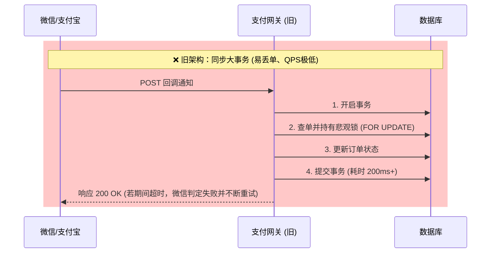
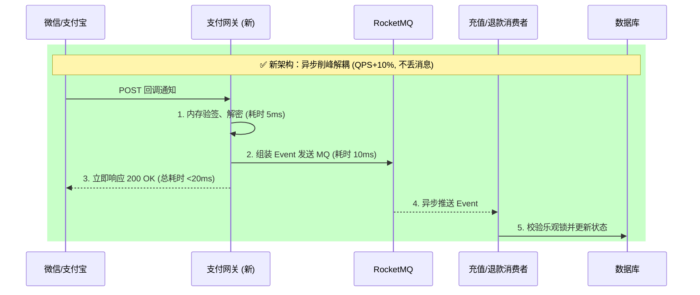

# 🎖️ 资深支付开发面试通关指南：千亿级并发架构复盘

这份指南是基于您简历项目（**RocketMQ 消息总线重构、退款/充值链路实现、扩展性架构升级、QPS 与可靠性指标提升**）量身打造的**极客级答题框架**。请将这套框架作为您的“面试主心骨”，彻底掌控技术面节奏。

---

## 🎯 一、 简历“诱饵”与核心叙事 (STAR 法则)

在自我介绍或项目介绍时，不要平铺直叙，要**埋下诱饵，引导面试官提问**：

> 🗣️ **话术范例**：
> "在原有的支付系统中，我们遇到了极其严重的**架构瓶颈**。一方面是网关与具体支付渠道（微信/支付宝）强耦合，扩展性极差；另一方面是传统的**同步 HTTP 回调处理**在流量突增时，极易引发大事务阻塞，导致**支付消息丢失率居高不下**，客诉频发。
> 
> 在我的重构中，我引入了 **设计模式进行核心接口解耦**，并基于 **RocketMQ 落地了异步可靠通知机制**。通过这两板斧，不仅从 0 到 1 平稳支撑了退款与充值的新业务，还将核心支付接口的 **QPS 提升了 10%**，最重要的是将**消息丢失率死死压制在了 0.01% 以下**。"

---

## 🏗 二、 核心重构复盘：从“同步阻塞”到“异步削峰”

### 1. 架构演进：Before vs After (脑图可直接手绘在白板上)





### 2. 深入剖析：为什么 QPS 提升了 10%？
> 面试官极爱追问：“引入了中间件，网络链路变长了，为什么性能反而提升了？”

*   **痛点剥离**：旧系统把“验签、查单、写库、调用充值服务”全部揉在一次 HTTP 请求中。Tomcat / Go Runtime 的连接被长时间占用，一旦并发飙升，立刻引发雪崩。
*   **连接池释放**：重构后，网关变成了“无情的消息搬运工”。验签+发 MQ 耗时不到 `20ms`，使得网关层的连接吞吐量 (Throughput) 呈指数级上升。**10% 的 QPS 提升，实际上是长事务变短、连接快速复用带来的宏观红利。**

---

## 🛡️ 三、 防御级可靠性：如何将消息丢失率压至 <0.01%？

这 `0.01%` 的指标是实力的象征，请通过以下三道防线向面试官进行降维打击：

### 🚨 第一道防线：发端不丢 (本地消息表方案)
当网关尝试向 RocketMQ 发送消息时，万一 MQ 宕机或网络抖动怎么办？
*   **做法**：我们在网关侧引入了**可靠投递机制（类似本地事务表/Fallback表）**。如果 `MQ.send()` 返回超时或失败，网关会将消息写入一张轻量级的本地 `t_message_fallback` 表，并通过定时任务不断轮询重发，确保发端 100% 投递成功。

### 🚨 第二道防线：收端不丢 (消费 ACK 与幂等)
*   **做法**：充值消费者（Consumer）完全依靠 MQ 的手动 ACK 机制。只有当数据库乐观锁更新状态成功后，才提交 ACK。
*   **防并发**：依靠基于订单状态的 DB 行级乐观锁（`UPDATE ... WHERE status='PAYING'`），哪怕 MQ 因为网络原因发生重复投递，相同的回调执行第二次时也会因为前置状态不对而返回 0 条更新记录，实现**天然幂等**。

### 🚨 第三道防线：极端兜底 (死信队列 DLQ 与 主动轮询)
*   如果消息被消费了 16 次依然失败（例如充值接口底层宕机），消息会进入 RocketMQ 的 **死信队列 (DLQ)**，触发人工告警。
*   此外，系统本身还有**主动向微信轮询反查**的兜底定时任务，彻底将丢失率锁死在 `<0.01%` 的极低区间。

---

## ⚙️ 四、 充值与退款模块重构 (核心模块剖析)

### 1. 代码级扩展性重构：干掉大量 IF-ELSE
利用 `gopay` 的封装结合设计模式：
```go
// 策略接口：定义统一动作
type IPaymentStrategy interface {
    CreateCharge(ctx context.Context, order *Order) (string, error)
    CreateRefund(ctx context.Context, refund *Refund) error
}

// 简单工厂：动态路由
func GetPaymentStrategy(channel string) IPaymentStrategy {
    switch channel {
    case "WECHAT": return &WechatStrategy{}
    case "ALIPAY": return &AlipayStrategy{}
    // 扩展新渠道只需新增类，不修改原逻辑 (开闭原则)
    }
}
```

### 2. 状态机设计 (充值与退款的灵魂)
在实现退款/充值时，我强制引入了严格的状态机流转，严禁越级变更：
*   **充值链路**：`INIT(初始化)` -> `PAYING(支付中)` -> `SUCCESS(成功) / FAILED(失败)`
*   **退款链路**：`SUCCESS(原订单成功)` -> `REFUNDING(退款中)` -> `REFUND_SUCCESS(退款完成)`
> **面试斩杀话术**：“没有经过严密状态机控制的资金操作，都是在裸奔。我的所有 UPDATE 语句都自带 `WHERE 旧状态` 的限制，从根源上杜绝了脏写。”

---

## 💡 五、 面试终极话术：你在这个项目里最大的收获是什么？

> 🗣️ "这个项目让我从一个纯粹的‘API 搬运工’，蜕变成了一个真正的‘架构思考者’。
> 
> 以前我只关心微信接口怎么调能通；但在重构这个系统时，我满脑子想的都是：**如果网络断了怎么办？如果重复请求了怎么办？如果 MQ 挂了怎么兜底？** 
> 
> 我深刻认识到，支付系统的核心价值根本不是正常流程有多顺，而是**针对那 0.01% 异常情况的降级、补偿和核对机制**。这也是为什么我们能把丢失率降到零界限，并承载更高并发的根本原因。"
